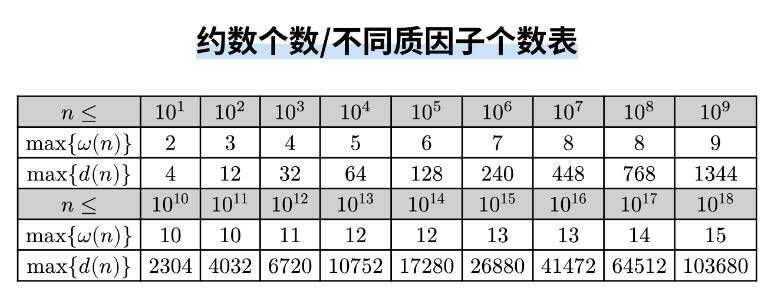

## 数学
常见数据范围



### 逆元

对任意模数p的逆元递推

```c++
std::vector<i64> inv(p);
inv[1] = 1;
for (i64 i = 2; i < p; i++) {
    inv[i] = (p - (p / i) * 1LL * inv[p % i] % p) % p;
}
```
### 组合数的恒等式和性质


### exgcd
```c++
int exgcd(int a, int b, int& x, int& y) {
    if (!b) {
        x = 1;
        y = 0;
        return a;
    }
    int d = exgcd(b, a % b, y, x);
    y -= a / b * x;
    return d;
}
```

### 线性筛和一些数论函数
$minp_{x}$代表x的最小质因数

$mu_{x}$是$\mu(x)$莫比乌斯函数

$
\mu(n) = 
\begin{cases} 
1, & \text{若 } n = 1, \\
0, & \text{若 } n \text{ 含有平方因子（即存在质数 } p \text{ 使得 } p^2 \mid n\text{）}, \\
(-1)^k, & \text{若 } n \text{ 是 } k \text{ 个不同质数的乘积}.
\end{cases}
$

$phi_{n}$是$\phi(n)$表示的是小于等于 
n 并且 n 互质的数的个数

一些积性函数都可以在线性筛中计算
```c++
struct Prime {
    std::vector<int> primes, minp, mu, phi;

    Prime(int n) {
        sieve(n);
    }

    void sieve(int n) {
        minp.assign(n + 1, 0);
        mu.assign(n + 1, 0);
        phi.assign(n + 1, 0);
        primes.clear();

        mu[1] = phi[1] = 1;
        for (int i = 2; i <= n; i++) {
            if (minp[i] == 0) {
                primes.push_back(i);
                minp[i] = i;
                mu[i] = -1;
                phi[i] = i - 1;
            }

            for (auto p : primes) {
                if (i * p > n) {
                    break;
                }
                minp[i * p] = p;
                if (i % p == 0) {
                    mu[i] = 0;
                    phi[i * p] = phi[i] * p;
                    break;
                }
                mu[i * p] = -mu[i];
                phi[i * p] = phi[i] * (p - 1);
            }
        }
    }
};
```

#### 二项式反演
第一种形式$g(n)表示至多n种方案的数量，f(n)表示恰好n种方案的数量$ $$g(n)=\sum_{i=0}^{n}{n \choose i}f(i)\Leftrightarrow  f(n) = \sum_{i=0}^{n}(-1)^{n-i}{n \choose i}g(i)$$ </br>
第二种形式$g(k)表示至少k种方案的数量，f(k)表示恰好k种方案的数量$ $$g(k)=\sum_{i=k}^{n}{i \choose k}f(i)\Leftrightarrow  f(k) = \sum_{i=k}^{n}(-1)^{i-k}{i \choose k}g(i)$$</br>

#### 欧拉函数反演
$$n=\sum_{d|n}\phi(d)$$
令$n=gcd(a,b)$，有

$$gcd(a,b)=\sum_{d|gcd(a,b)}\phi(d)=\sum_{d}[d|a][d|b]\phi(d)$$

那么

$$
\sum_{i=1}^{n} \gcd(i, n) = \sum_{d} \sum_{i=1}^{n} 
[d|i] [d|n]
 \varphi(d) = \sum_{d} \left\lfloor \frac{n}{d} \right\rfloor [d|n] \varphi(d) = \sum_{d|n} \left\lfloor \frac{n}{d} \right\rfloor \varphi(d).
$$

#### 莫比乌斯反演
对于数论函数$g(n),f(n)$，如果有$$f(n)=\sum_{d|n}g(d)$$那么$$g(n)=\sum_{d|n}\mu(d)f(\frac{n}{d})$$

### 线性基(异或线性基)

```c++
struct LinearBasis {
    static constexpr int K = 60;
    array<ull, K> b;

    LinearBasis() {
        b.fill(0);
    }

    bool insert(ull x) {
        for (int i = K - 1; i >= 0; i--) {
            if (!(x >> i & 1)) continue;
            if (!b[i]) {
                b[i] = x;
                return 1;
            }
            x ^= b[i];
        }
        return 0;
    }

    ull ask(ull x = 0) {
        for (int i = K - 1; i >= 0; i--) {
            if ((x ^ b[i]) > x) {
                x ^= b[i];
            }
        }
        return x;
    }
};
```

### 高斯消元

```c++
int row = 1;
for (int col = 63; col >= 0 && row <= n; col--) {
    for (int i = row; i <= n; i++) {
        if (a[i] >> col & 1) {
            std::swap(a[row], a[i]);
            break;
        }
    }
    if (!(a[row] >> col & 1)) continue;
    for (int i = 1; i <= n; i++) {
        if (i == row) continue;
        if (a[i] >> col & 1) {
            a[i] ^= a[row];
        }
    }
    row++;
}
--row;
```
#### 查询k小值
高斯消元后能保证每一个位数上的1都是独特的，所以说查询第k个元素的时候直接
对k进行二进制分解对于每一位上的1，去找线性基上唯一的1对应的数异或即可。

注意对0的特判(没有0应该查询x-1)(线性基相比于原来的大小变小就是可以有0)

## 多项式

## 图论

### 树
#### 重心

性质:

1.以树的重心为根时，所有子树的大小都不超过整棵树大小的一半，这个是充要条件（重心至多两个，并且相邻

2.树中所有点到某个点的距离和中，到重心的距离和是最小的；如果有两个重心，那么到它们的距离和一样。

#### 树链剖分
```c++
struct HLD {
    int n;
    std::vector<int> par, dep, top, son, siz;
    std::vector<std::vector<int>> G;

    HLD() {}
    HLD(int _n) {
        init(_n);
    }
    void init(int _n) {
        this->n = _n;
        par.resize(n + 1);
        dep.resize(n + 1);
        top.resize(n + 1);
        son.resize(n + 1);
        siz.resize(n + 1);
        G.assign(n, {});
    }

    void addEdge(int u, int v) {
        G[u].push_back(v);
    }

    void work(int root = 1) {
        dfs1(root, root);
        dfs2(root, root);
    }

    void dfs1(int u, int fa) {
        siz[u] = 1;
        for (auto v : G[u]) {
            if (v == fa) continue;
            par[v] = u;
            dep[v] = dep[u] + 1;
            dfs1(v, u);
            siz[u] += siz[v];
            if (siz[v] > siz[son[u]]) {
                son[u] = v;
            }
        }
    }

    void dfs2(int u, int topf) {
        top[u] = topf;
        if (son[u]) {
            dfs2(son[u], topf);
        }
        for (auto v : G[u]) {
            if (son[u] == v || par[u] == v) continue;
            dfs2(v, v);
        }
    }

    int lca(int x, int y) {
        while (top[x] != top[y]) {
            if (dep[top[x]] < dep[top[y]]) {
                std::swap(x, y);
            }
            // to do [dfn[top[x]] -> dfn[x]]
            x = par[top[x]];
        }
        if (dep[x] < dep[y]) {
            std::swap(x, y);
        }
        // to do [dfn[y] -> dfn[x]]
        return y;
    }

    int dist(int u, int v) {
        return dep[u] + dep[v] - 2 * dep[lca(u, v)];
    }
};
```

### 强连通分量

```c++
struct SCC {
    int n;                             // 节点数
    std::vector<std::vector<int>> adj; // 图的邻接表
    std::vector<int> stk;              // 栈，用于 Tarjan 算法
    std::vector<int> dfn, low, bel;    // dfn: 访问顺序, low: 最小可回溯 dfn, bel: 节点所属 SCC 编号
    int cur, cnt;                      // cur: 当前时间戳, cnt: SCC 编号计数

    SCC() {}
    SCC(int n) {
        init(n);
    }

    void init(int n) {
        this->n = n;
        adj.assign(n, {});
        dfn.assign(n, -1);
        low.resize(n);
        bel.assign(n, -1);
        stk.clear();
        cur = cnt = 0;
    }

    void addEdge(int u, int v) {
        adj[u].push_back(v);
    }

    void dfs(int x) {
        dfn[x] = low[x] = cur++;
        stk.push_back(x);

        for (auto y : adj[x]) {
            if (dfn[y] == -1) {
                dfs(y);
                low[x] = std::min(low[x], low[y]);
            } else if (bel[y] == -1) {
                low[x] = std::min(low[x], dfn[y]);
            }
        }

        if (dfn[x] == low[x]) {
            int y;
            do {
                y = stk.back();
                bel[y] = cnt;
                stk.pop_back();
            } while (y != x);
            cnt++;
        }
    }

    const std::vector<int>& work() {
        for (int i = 0; i < n; i++) {
            if (dfn[i] == -1) {
                dfs(i);
            }
        }
        return bel;
    }
};
```

### 点双

```c++
struct VDcc {
    int n, stamp;
    std::vector<int> dfn, low, stk, cut;
    std::vector<std::vector<int>> adj, vDc;

    VDcc() {}
    VDcc(int n) {
        init(n);
    }

    void init(int n) {
        this->n = n;
        stamp = -1;
        dfn.assign(n, -1);
        low.assign(n, -1);
        cut.assign(n, 0);
        adj.assign(n, {});

        stk.clear();
        vDc.clear();
    }

    void addEdge(int u, int v) {
        adj[u].push_back(v);
    }

    void tarjan(int u, int anc) {
        dfn[u] = low[u] = ++stamp;
        if (adj[u].size() == 0) {
            vDc.push_back({ u });
            return;
        }
        stk.push_back(u);
        int child = 0;
        for (auto v : adj[u]) {
            if (dfn[v] == -1) {
                child++;
                tarjan(v, anc);
                low[u] = std::min(low[u], low[v]);
                if (low[v] >= dfn[u]) {
                    if (u != anc) {
                        cut[u] = 1;
                    }
                    std::vector<int> vc;
                    int tmp;
                    do {
                        tmp = stk.back();
                        stk.pop_back();
                        vc.push_back(tmp);
                    } while (v != tmp);
                    vc.push_back(u);
                    vDc.push_back(vc);
                }
            } else {
                low[u] = std::min(low[u], dfn[v]);
            }
        }
        if (child >= 2 && u == anc) cut[u] = 1;
    }

    const std::vector<std::vector<int>>& work() {
        for (int i = 0; i < n; i++) {
            if (dfn[i] == -1) {
                tarjan(i, i);
            }
        }
        return vDc;
    }
};
```

### 边双

```c++
struct EDcc {
    int n, m, idx, stamp;
    std::vector<int> e, ne, h;
    std::vector<int> dfn, low, stk;
    std::vector<char> bridge; // 判断边是不是桥
    std::vector<std::vector<int>> eDc;

    EDcc() {}
    EDcc(int n, int m) {
        init(n, m);
    }

    void init(int n, int m) {
        this->n = n;
        this->m = m;
        idx = -1;
        stamp = -1;
        h.assign(n, -1);
        dfn.assign(n, -1);
        low.assign(n, -1);

        ne.assign(m * 2, -1);
        e.assign(m * 2, -1);
        bridge.assign(m * 2, -1);

        stk.clear();
        eDc.clear();
    }

    void addEdge(int u, int v) {
        e[++idx] = v;
        ne[idx] = h[u];
        h[u] = ++idx;
    }

    void tarjan(int u, int lst) {
        dfn[u] = low[u] = ++stamp;
        stk.push_back(u);

        for (int i = h[u]; i != -1; i = ne[i]) {
            int v = e[i];
            if ((i ^ 1) == lst) continue;
            if (dfn[v] == -1) {
                tarjan(v, i);
                low[u] = std::min(low[u], low[v]);
                if (low[v] > dfn[u]) {
                    bridge[i] = bridge[i ^ 1] = 1;
                }
            } else {
                low[u] = std::min(low[u], dfn[v]);
            }
        }
        if (dfn[u] == low[u]) {
            std::vector<int> vc;
            int tmp;
            do {
                tmp = stk.back();
                stk.pop_back();
                vc.push_back(tmp);
            } while (tmp != u);
            eDc.push_back(vc);
        }
    }

    void work() {
        for (int i = 0; i < n; i++) {
            if (dfn[i] == -1) {
                tarjan(i, -1);
            }
        }
    }
};
```
### 网络流

最大流

```c++
struct MaxFlow {
    int n, m, idx;
    std::vector<int> e, ne, h;
    std::vector<int> cur, dep;
    std::vector<LL> val;

    MaxFlow(int _n, int _m) {
        init(_n, _m);
    }

    void init(int _n, int _m) {
        this->n = _n;
        this->m = _m;
        idx = -1;
        e.resize(m << 1);
        ne.resize(m << 1);
        h.resize(n, -1);
        val.resize(m << 1);
        cur.resize(n);
        dep.resize(n);
    }

    void addEdge(int from, int to, LL w) {
        e[++idx] = to;
        val[idx] = w;
        ne[idx] = h[from];
        h[from] = idx;
    }

    bool bfs(int st, int ed) {
        dep.assign(n, -1);
        std::queue<int> q;
        q.push(st);
        dep[st] = 0;
        while (!q.empty()) {
            auto u = q.front();
            q.pop();
            cur[u] = h[u];
            for (int i = h[u]; ~i; i = ne[i]) {
                int v = e[i];
                if (dep[v] == -1 && val[i]) {
                    dep[v] = dep[u] + 1;
                    if (v == ed) return true;
                    q.push(v);
                }
            }
        }
        return false;
    }

    LL dfs(int ed, int u, LL limit) {
        if (u == ed) return limit;
        LL flow = 0;
        for (int i = cur[u]; ~i; i = ne[i]) {
            cur[u] = i;
            int v = e[i];
            if (dep[v] == dep[u] + 1 && val[i]) {
                LL find_flow = dfs(ed, v, std::min(limit - flow, val[i]));
                val[i] -= find_flow;
                val[i ^ 1] += find_flow;
                flow += find_flow;
                if (flow == limit)
                    return flow;
            }
        }
        return flow;
    }

    LL work(int s, int t) {
        LL maxflow = 0;
        while (bfs(s, t)) {
            maxflow += dfs(t, s, std::numeric_limits<LL>::max() / 2);
            maxflow = std::min(maxflow, std::numeric_limits<LL>::max() / 2);
        }
        return maxflow;
    }
};
```
最小费用最大流，SPFA控制费用
```c++
struct MCF {
    int n, m, idx;
    std::vector<int> h, ne, e;
    std::vector<int> pre, flow;
    std::vector<int> dis, cap, cost;

    MCF(int _n, int _m): idx(-1) {
        init(_n, _m);
    }

    void init(int _n, int _m) {
        this->n = _n, this->m = _m;
        h.resize(n, -1);
        ne.resize(m << 1);
        e.resize(m << 1);

        pre.resize(m << 1);
        flow.resize(n);

        dis.resize(n);
        cap.resize(m << 1);
        cost.resize(m << 1);
    }

    void addEdge(int u, int v, int vol, int w) {
        add(u, v, vol, w);
        add(v, u, 0, -w);
    }

    bool spfa(int st, int ed) {
        // shortest path
        dis.assign(n, 0x3f3f3f3f);
        flow.assign(n, 0x3f3f3f3f);
        std::vector<char> vis(n);
        std::queue<int> q;
        q.push(st);
        vis[st] = 1, dis[st] = 0;
        while (!q.empty()) {
            auto u = q.front();
            q.pop();
            vis[u] = 0;
            for (int i = h[u]; ~i; i = ne[i]) {
                int v = e[i];
                if (!cap[i]) continue;
                if (dis[v] > dis[u] + cost[i]) {
                    dis[v] = dis[u] + cost[i];
                    flow[v] = std::min(flow[u], cap[i]);
                    pre[v] = i;
                    if (!vis[v]) {
                        q.push(v);
                        vis[v] = 1;
                    }
                }
            }
        }
        return dis[ed] != 0x3f3f3f3f;
    }

    void update(int st, int ed) {
        int u = ed;
        while (u != st) {
            int i = pre[u];
            cap[i] -= flow[ed];
            cap[i ^ 1] += flow[ed];
            u = e[i ^ 1];
        }
    }

    std::pair<int, int> work(int st, int ed) {
        int maxflow = 0, res_cost = 0;
        while (spfa(st, ed)) {
            update(st, ed);
            maxflow += flow[ed];
            res_cost += flow[ed] * dis[ed];
        }
        return { maxflow, res_cost };
    }

private:
    void add(int a, int b, int vol, int w) {
        e[++idx] = b;
        cap[idx] = vol;
        cost[idx] = w;
        ne[idx] = h[a];
        h[a] = idx;
    }
};
```

## 字符串
先介绍一下$\pi$函数

$$\pi[i] = \max_ {k = 0 \dots i} \{k : s[0 \dots k-1] = s[i-(k-1) \dots i] \}$$

其中特殊地，$\pi[0]=0$
```c++
std::vector<int> pre_pi(std::string s) {
  int n = (int)s.length();
  vector<int> pi(n);
  for (int i = 1; i < n; i++) {
    int j = pi[i - 1];
    while (j > 0 && s[i] != s[j]) {
         j = pi[j - 1];
    }
    if (s[i] == s[j]) j++;
    pi[i] = j;
  }
  return pi;
}
```
### kmp

不妨把两个字符串连接在一起，利用$\pi$函数即可解决

```c++
//return positions that successfully matched
vector<int> find_occurrences(string text, string pattern) {
  string cur = pattern + '#' + text;
  int sz1 = text.size(), sz2 = pattern.size();
  vector<int> v;
  vector<int> lps = prefix_function(cur);
  for (int i = sz2 + 1; i <= sz1 + sz2; i++) {
    if (lps[i] == sz2) v.push_back(i - 2 * sz2);
  }
  return v;
}
```
### Z函数（扩展kmp）

$z[i]$匹配的是s和s[i:]的最长公共前缀

```c++
vector<int> z_function(string s) {
  int n = (int)s.length();
  vector<int> z(n);
  for (int i = 1, l = 0, r = 0; i < n; ++i) {
    if (i <= r && z[i - l] < r - i + 1) {
      z[i] = z[i - l];
    } else {
      z[i] = max(0, r - i + 1);
      while (i + z[i] < n && s[z[i]] == s[i + z[i]]) ++z[i];
    }
    if (i + z[i] - 1 > r) l = i, r = i + z[i] - 1;
  }
  return z;
}
```
### AC自动机

trie 树上的某一个节点代表前缀s的终止节点

设这个节点为i，代表的前缀为s

如果存在节点j，代表前缀为t，t的前缀最大匹配s的后缀，并且$s \neq t$

那么$fail_{i} = j$

这样的话匹配失败之后，fail指针就可以很快找到接下来的节点匹配了
```c++

struct AhoC {
    static constexpr int N = 5E5 + 10, AP = 26, offset = 'a';

    int idx = 0;
    int nxt[N][AP];
    int fail[N], cnt[N];

    std::vector<pii> order;

    AhoC() {}
    void clear() {
        order.clear();
        for (int i = 0; i <= idx; i++) {
            fail[i] = 0, cnt[i] = 0;
            for (int j = 0; j < AP; j++) {
                nxt[i][j] = 0;
            }
        }
        idx = 0;
    }

    void insert(const std::string& s, int num) {
        int p = 0;
        for (int i = 0; i < (int) s.size(); i++) {
            int u = s[i] - offset;
            if (!nxt[p][u]) nxt[p][u] = ++idx;
            p = nxt[p][u];
        }
        order.pb({ p, num });
    }

    void build() {
        std::queue<int> q;
        for (int i = 0; i < AP; i++) {
            if (nxt[0][i]) {
                q.push(nxt[0][i]);
            }
        }
        while (!q.empty()) {
            int u = q.front();
            q.pop();
            for (int i = 0; i < AP; i++) {
                if (nxt[u][i]) {
                    fail[nxt[u][i]] = nxt[fail[u]][i];
                    q.push(nxt[u][i]);
                } else {
                    nxt[u][i] = nxt[fail[u]][i];
                }
            }
        }
    }

    void query(const std::string& s) {
        int p = 0;
        for (int i = 0; i < (int) s.size(); i++) {
            p = nxt[p][s[i] - offset];
            for (int t = p; t; t = fail[t]) {
                cnt[t]++;
            }
        }
    }
}
```

### Manacher

函数会把原先字符串两个数之间（包括头尾）插入'#'，$d_{i}$表示以位置i为中心的最长回文字符串有多长

```c++
std::vector<int> Manacher(std::string& t) {
    int n = t.size();
    string s;
    s.resize(n * 2 + 1);
    for (int i = 0; i < n; i++) {
        s[i << 1] = '#';
        s[i << 1 | 1] = t[i];
    }
    s[2 * n] = '#';
    n = 2 * n + 1;
    std::vector<int> d(n);
    for (int i = 0, l = 0, r = -1; i < n; i++) {
        int k = (i > r) ? 1 : std::min(d[l + r - i], r - i + 1);
        while (0 <= i - k && i + k < n && s[i - k] == s[i + k]) {
            k++;
        }
        d[i] = --k;
        if (i + k > r) {
            l = i - k;
            r = i + k;
        }
    }
    return d;
}
```
## 数据结构
### 树状数组
```c++
template <typename T>
struct Fenwick {
    int n;
    std::vector<T> tr;

    Fenwick() {};
    Fenwick(int _n) {
        this->n = _n;
        tr.resize(n + 1);
    };

    T presum(int x) {
        T res {};
        for (int i = x; i >= 1; i -= i & (-i)) {
            res = res + tr[i];
        }
        return res;
    }

    // sum of (x , y]
    T rangesum(int l, int r) {
        if (l > r)
            std::swap(l, r);
        return presum(r) - presum(l);
    }

    void add(int x, T c) {
        for (int i = x; i <= n; i += i & (-i)) {
            tr[i] = tr[i] + c;
        }
    }
};
```
### 线段树
```c++
template <class Info>
struct SGT {
#define l(u) (u << 1)
#define r(u) (u << 1 | 1)
    int n;
    std::vector<Info> info;
    SGT() {}
    SGT(int _n) {
        std::vector<Info> _init(_n + 1, Info());
        init(_init);
    }
    template <class T>
    void init(const std::vector<T>& _init) {
        // build [1,n]
        n = _init.size() - 1;
        info.assign(n << 2, Info());
        auto build = [&](auto self, int l, int r, int u) {
            if (l == r) {
                info[u] = _init[l];
                return;
            }
            int m = (l + r) >> 1;
            self(self, l, m, l(u));
            self(self, m + 1, r, r(u));
            pushup(u);
        };
        build(build, 1, n, 1);
    }
    void pushup(int u) {
        info[u] = info[l(u)] + info[r(u)];
    }
    template <typename T>
    void update(int pos, int u, int l, int r, const T add) {
        if (l == pos && r == pos) {
            info[u] = info[u] + add;
            return;
        }
        int m = (l + r) >> 1;
        if (pos <= m) {
            update<T>(pos, l(u), l, m, add);
        }
        if (pos > m) {
            update<T>(pos, r(u), m + 1, r, add);
        }
        pushup(u);
    }
    Info query(int ql, int qr, int u, int l, int r) {
        if (qr < l || ql > r) {
            return Info();
        }
        if (ql <= l && r <= qr) {
            return info[u];
        }
        int m = (l + r) >> 1;
        return query(ql, qr, l(u), l, m) + query(ql, qr, r(u), m + 1, r);
    }
    int lower_search(int l, int r, int u, int find) {
        if (l == r) {
            return l;
        }
        int m = (l + r) >> 1;
        if (info[l(u)].max < find) {
            return lower_search(m + 1, r, r(u), find);
        }
        return lower_search(l, m, l(u), find);
    }
    int upper_search(int l, int r, int u, int find) {
        if (l == r) {
            return l;
        }
        int m = (l + r) >> 1;
        if (info[l(u)].max <= find) {
            return upper_search(m + 1, r, r(u), find);
        }
        return upper_search(l, m, l(u), find);
    }
#undef l
#undef r
};

struct Info {
    int max, min;
    Info(): max(std::numeric_limits<int>::min() / 2), min(std::numeric_limits<int>::max() / 2) {}
    Info(int val): max(val), min(val) {}
    Info(int _max, int _min): max(_max), min(_min) {}
    Info operator+(int x) {
        return Info(max + x, min + x);
    }
    Info operator+(const Info& rhs) {
        auto cmax = std::max(rhs.max, max);
        auto cmin = std::min(rhs.min, min);
        return Info(cmax, cmin);
    }
};
```
### 懒线段树
```c++
template <class Info, class Tag>
struct LSGT {
#define l(u) (u << 1)
#define r(u) (u << 1 | 1)
    int n;
    std::vector<Info> info;
    std::vector<Tag> tag;
    LSGT() {}
    LSGT(int _n) {
        std::vector<Info> _init(_n + 1, Info());
        init(_init);
    }
    template <class T>
    void init(const std::vector<T>& _init) {
        // build [1,n]
        n = _init.size() - 1;
        info.assign(n << 2, Info());
        tag.assign(n << 2, Tag());
        auto build = [&](auto self, int l, int r, int u) {
            if (l == r) {
                info[u] = _init[l];
                return;
            }
            int m = (l + r) >> 1;
            self(self, l, m, l(u));
            self(self, m + 1, r, r(u));
            pushup(u);
        };
        build(build, 1, n, 1);
    }
    void pushup(int u) {
        info[u] = info[l(u)] + info[r(u)];
    }
    void pushdown(int u) {
        tag[l(u)].apply(tag[u]), info[l(u)].apply(tag[u]);
        tag[r(u)].apply(tag[u]), info[r(u)].apply(tag[u]);
        tag[u] = Tag();
    }
    template <typename T>
    void update(int ql, int qr, int u, int l, int r, const T add) {
        if (ql <= l && r <= qr) {
            info[u] = info[u] + add;
            tag[u] = tag[u] + add;
            return;
        }
        int m = (l + r) >> 1;
        pushdown(u);
        if (ql <= m) {
            update<T>(ql, qr, l(u), l, m, add);
        }
        if (qr > m) {
            update<T>(ql, qr, r(u), m + 1, r, add);
        }
        pushup(u);
    }
    Info query(int ql, int qr, int u, int l, int r) {
        if (qr < l || ql > r) {
            return Info();
        }
        if (ql <= l && r <= qr) {
            return info[u];
        }
        int m = (l + r) >> 1;
        pushdown(u);
        return query(ql, qr, l(u), l, m) + query(ql, qr, r(u), m + 1, r);
    }
    int lower_search(int l, int r, int u, int find) {
        if (l == r) {
            return l;
        }
        int m = (l + r) >> 1;
        pushdown(u);
        if (info[l(u)].max < find) {
            return lower_search(m + 1, r, r(u), find);
        }
        return lower_search(l, m, l(u), find);
    }
    int upper_search(int l, int r, int u, int find) {
        if (l == r) {
            return l;
        }
        int m = (l + r) >> 1;
        pushdown(u);
        if (info[l(u)].max <= find) {
            return upper_search(m + 1, r, r(u), find);
        }
        return upper_search(l, m, l(u), find);
    }
#undef l
#undef r
};

struct Tag {
    int x;
    Tag() {}
    Tag(int _x): x(_x) {};
    Tag operator+(int add) {
        return Tag(x + add);
    }
    void apply(const Tag& p) {
        x += p.x;
    }
};

struct Info {
    int max, min;
    Info(): max(std::numeric_limits<int>::min() / 2), min(std::numeric_limits<int>::max() / 2) {}
    Info(int val): max(val), min(val) {}
    Info(int _max, int _min): max(_max), min(_min) {}
    Info operator+(int x) {
        return Info(max + x, min + x);
    }
    Info operator+(const Info& rhs) {
        auto cmax = std::max(rhs.max, max);
        auto cmin = std::min(rhs.min, min);
        return Info(cmax, cmin);
    }
    void apply(Tag& t) {
        max += t.x, min += t.x;
    }
};
```
### 并查集
维护大小的并查集
```c++
struct DSU {
    std::vector<int> f, siz;

    DSU() {}
    DSU(int n) {
        init(n);
    }

    void init(int n) {
        f.resize(n);
        std::iota(f.begin() + 1, f.end(), 1);
        siz.assign(n, 1);
    }

    int find(int x) {
        while (x != f[x]) {
            x = f[x] = f[f[x]];
        }
        return x;
    }

    bool same(int x, int y) {
        return find(x) == find(y);
    }

    bool merge(int x, int y) {
        x = find(x);
        y = find(y);
        if (x == y) {
            return false;
        }
        siz[x] += siz[y];
        f[y] = x;
        return true;
    }

    int size(int x) {
        return siz[find(x)];
    }
};
```

带权并查集（维护到根节点位置）

```c++
struct WeightDSU {
    // siz维护子树的大小
    // dist根到当前点的距离
    std::vector<int> f, dist, dep;

    WeightDSU() {}
    WeightDSU(int n) {
        init(n);
    }

    void init(int n) {
        f.resize(n);
        std::iota(f.begin() + 1, f.end(), 1);
        dist.assign(n, 0);
        dep.assign(n, 0);
    }

    int find(int x) {
        if (f[x] != x) {
            int t = f[x];
            f[x] = find(f[x]);
            dist[x] += dist[t];
        }
        return f[x];
    }

    bool same(int x, int y) {
        return find(x) == find(y);
    }

    bool merge(int x, int y) {
        int rootx = find(x);
        y = find(y);
        if (rootx == y) {
            return false;
        }
        dep[rootx] = std::max(dep[rootx], dep[y] + dist[x] + 1);
        dist[y] = dist[x] + 1;
        f[y] = rootx;
        return true;
    }
};
```
## 计算几何

## 杂项

### 点分治

### 

### 莫队
就是分块离线
洛谷P1494直接
```c++
struct Query {
    int l, r, id;
};

void solve() {
    int n, m;
    std::cin >> n >> m;
    std::vector<int> col(n + 1), belong(n + 1), cnt(n + 1);
    std::vector<Query> q(m + 1);
    int block = std::max(10, (int) sqrt(n));
    for (int i = 1; i <= n; i++) {
        std::cin >> col[i];
        belong[i] = i / block;
    }
    for (int i = 1; i <= m; i++) {
        std::cin >> q[i].l >> q[i].r;
        q[i].id = i;
    }
    LL res = 0;
    auto add = [&](int c) -> void {
        res += 1LL * cnt[c];
        cnt[c]++;
    };
    auto sub = [&](int c) -> void {
        cnt[c]--;
        res -= 1LL * cnt[c];
    };

    std::sort(q.begin() + 1, q.end(), [&](const Query& a, const Query& b) {
        if (belong[a.l] == belong[b.l]) {
            if (belong[a.l] & 1) return a.r > b.r;
            return a.r < b.r;
        }
        return belong[a.l] < belong[b.l];
    });
    std::vector<std::pair<LL, LL>> ans(m + 1);
    for (int l = 1, r = 0, i = 1; i <= m; i++) {
        if (q[i].l == q[i].r) {
            ans[q[i].id] = { 0, 1 };
            continue;
        }
        while (l > q[i].l) {
            add(col[--l]);
        }
        while (r < q[i].r) {
            add(col[++r]);
        }
        while (l < q[i].l) {
            sub(col[l++]);
        }
        while (r > q[i].r) {
            sub(col[r--]);
        }
        ans[q[i].id] = { res, 1LL * (r - l) * (r - l + 1) / 2 };
    }

    for (int i = 1; i <= m; i++) {
        auto [num, deno] = ans[i];
        if (num == 0) {
            std::cout << 0 << "/" << 1 << '\n';
        } else {
            auto g = std::__gcd(num, deno);
            std::cout << num / g << '/' << deno / g << '\n';
        }
    }
}
```